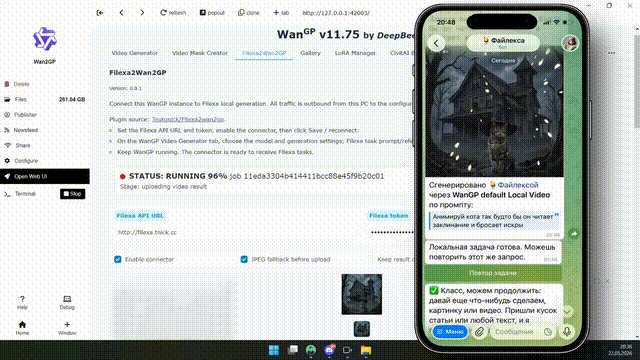

# Filexa2Wan2GP Connector

Connects Wan2GP to Filexa local generation so Telegram users can run local image and short video jobs on their own PC.
The connector polls Filexa, submits tasks through Wan2GP's plugin API, reports progress, and returns supported results through the Filexa local connector API.

Bot: https://t.me/WorkOnBigFilesBot

Not affiliated with, endorsed by, or sponsored by Wan2GP.

## Layout

- `plugin.py` - Wan2GP plugin implementation.
- `plugin_info.json` - metadata used by the Wan2GP plugin manager.
- `README.md` - installation and usage guide.
- `LICENSE` - source code license.
- `NOTICE.md` - legal notices and disclaimers.
- `SECURITY.md` - vulnerability reporting policy.

Prebuilt packages are not required. Wan2GP loads this connector as a Python plugin.

## Install For A Wan2GP User

The connector is designed to work with https://t.me/WorkOnBigFilesBot only.

1. Install Wan2GP from the official project:
   https://github.com/deepbeepmeep/Wan2GP
2. Launch Wan2GP once, install the model family you want to use, and verify one local generation manually before connecting Filexa.
3. Copy this directory into the Wan2GP plugins folder as:
   `Wan2GP\plugins\Filexa2wan2gp`
4. Restart Wan2GP.
5. Configure the Wan2GP `Video Generator` tab with the model/settings you want Filexa video jobs
   to use.
6. In the Filexa bot, open local generation settings, choose WanGP, and copy the API URL and token.
7. Paste the API URL and token into the connector tab, enable polling, then click `Save / reconnect`.
8. Optional: enable `Manual settings snapshots` and update the image/video snapshot by button when
   you want to freeze WanGP settings instead of refreshing them automatically before each task.

Once enabled, keep Wan2GP running. The connector makes only outbound HTTP/HTTPS requests to Filexa. No public Wan2GP port is required.

## Wan2GP Settings

The connector is deliberately generic:

- Filexa sends `engine`, `client_type`, `profile`, `params`, prompt, references, and result/status URLs.
- By default the connector refreshes only the matching WanGP settings snapshot just before a task:
  video tasks refresh the video-output snapshot, image tasks refresh the image-output snapshot.
  WanGP `image_mode` and model metadata are used to avoid saving video settings into the image
  snapshot or the other way around.
- Opening the `Filexa2Wan2GP` tab also refreshes and persists the current image/video snapshot in
  the correct slot when manual snapshots are off. This lets the connector remember the user's last
  configured image and video models across WanGP restarts.
- `Manual settings snapshots` is an advanced mode. When it is enabled, the connector never
  refreshes snapshots automatically; use `Update image snapshot` or `Update video snapshot` after
  configuring WanGP manually.
- Filexa prompt overrides the template prompt.
- If Filexa sends `params.wangp_task`, that object is submitted to Wan2GP as the full task payload after Filexa prompt and references are applied.
- If Filexa sends `params.reference_bindings`, it can map input references to Wan2GP setting keys. Values may be a reference index, a list of indexes, or `"all"`.
- For image edit and image-to-video tasks without explicit bindings, the first reference is placed
  in `image_start`, all references are placed in `image_refs`, and the connector enables WanGP's
  start/reference prompt mode when the selected model definition advertises it.

This keeps the plugin transparent enough for future Wan2GP methods while allowing Filexa to decide which methods are exposed in the bot UI.

## Behavior

- The connector polls Filexa every 10 seconds while enabled.
- It requires a Filexa API URL and bearer token generated by the bot.
- If Filexa is unavailable or the token is rejected, the connector switches itself to disabled
  and stops polling. Fix the URL/token/server, then enable it manually and click `Save / reconnect`.
- The API URL must point to the same Filexa origin for every task URL returned by Filexa.
- It rejects tasks for other engines and accepts only `wangp`.
- It limits prompts, local references, and task URL shapes before starting Wan2GP work.
- It stores configuration in `filexa2wan2gp_config.json` inside the local plugin directory.
- It downloads I2I references into a temporary directory and removes them when the task finishes.
- It runs background generation through WanGP's in-process/headless `shared.api` session. The
  Gradio `api_session` passed to plugin UI callbacks is not used by the worker because recent
  WanGP builds require a live browser `session_hash` for WebUI-session submissions.
- Its Status panel always shows the loaded connector version, plugin file path, worker backend,
  last error, and the latest diagnostic events. There is no separate debug toggle.
- The tab also shows a compact live activity line, refreshed every few seconds, and mini previews
  of references received for the active task, so users can see that WanGP is busy even when the main
  WanGP tab is silent.
- It reports progress through Wan2GP callbacks when progress data is available.
- The `Cancel active task` button asks both Wan2GP and Filexa to cancel the active task, closes the
  worker session, and returns the connector UI to idle/enabled state if Wan2GP accepts the stop.

## Result Delivery

Image results are returned with the same delivery strategy as the Filexa SwarmUI connector:

- one short direct image upload capped at 40 MiB;
- optional JPEG conversion at 80 percent quality;
- fallback binary chunks of 50 KiB;
- fallback JSON/base64 chunks of 8 KiB;
- safe JSON/base64 chunks of 4 KiB with `Connection: close` and pauses between chunks;
- local-only completion when upload is disabled, the image is too large after compression, or Wan2GP returns a non-image artifact.

Video results are direct-upload only:

- accepted video MIME types are MP4, WebM, and QuickTime/MOV;
- direct video upload is capped at 50 MiB;
- chunked fallback is intentionally not used for video;
- if direct video upload fails or the file is too large, the generated file stays on the user's PC and Filexa receives a local-only completion message.

If Wan2GP returns a file that is neither an accepted image nor an accepted video, the connector leaves it on the user's PC and reports local-only completion.

## Troubleshooting

### The connector does not appear in Wan2GP.

Make sure the files are in `Wan2GP\plugins\Filexa2wan2gp\plugin.py`, then restart Wan2GP.

### The connector says the token is invalid.

Regenerate the local connector token in the Filexa bot, paste it into the connector tab, and save again. Tokens are stored locally on your PC; anyone who can read the plugin config file may be able to use the token.

### Wan2GP starts but Filexa waits forever.

Cancel the task in Filexa with `/cancel`, then click `Cancel active task` in the connector tab. If Wan2GP itself is stuck, restart Wan2GP and enable the connector again.

### The connector switched to DISABLED.

This is intentional after a rejected token, unavailable Filexa server, or unreachable API URL. Fix
the bot URL/token/server first, then enable the connector and click `Save / reconnect`; it will not
resume polling automatically.

### Result upload fails on a poor network.

Leave JPEG conversion enabled. The connector will degrade from direct upload to chunked uploads and remember a successful text-chunk mode for several hours.

## Legal Notice

This repository contains only the Filexa2Wan2GP Connector source code.

The connector is licensed under the MIT License. The Filexa bot/API service is provided under separate Filexa Terms of Use and Privacy Policy:
https://teutonick.github.io/bot-legal-docs/privacy

This connector is not part of Wan2GP and is not affiliated with or endorsed by the Wan2GP project. Wan2GP, AI models, model weights, checkpoints, drivers, and other runtime components are third-party software and may have their own licenses and restrictions.

Users are solely responsible for installing Wan2GP, selecting and licensing models, securing their API tokens, operating their local computer, reviewing generated outputs, and complying with applicable laws and third-party terms.

## Security Notice

Security issues should be reported privately according to SECURITY.md.
